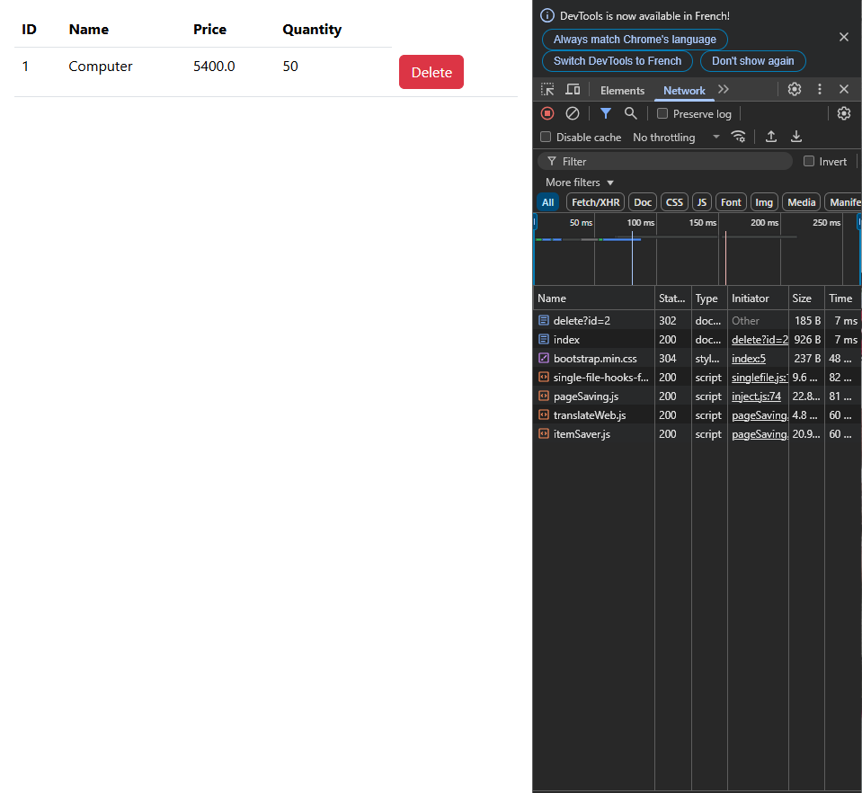

<h2> gestion d'un produit</h2>

ici ce que fait mon application quand je supprime un utilisateur, je vois dans l'onglet Network des DevTools que ça déclenche une requête HTTP.
La requête principale que je vois est "delete?id=2" - c'est une requête qui envoie l'instruction de supprimer l'utilisateur avec l'ID 2 au serveur. Elle reçoit un code 302, ce qui est une redirection. Ça signifie que mon application, après avoir supprimé l'utilisateur, redirige l'utilisateur vers une autre page, probablement pour montrer la liste mise à jour.
faite le sous code html

